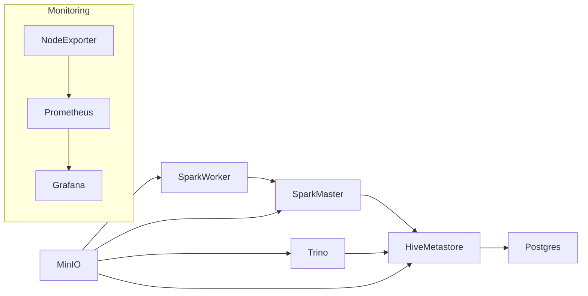

# lakehouse_athena

Este repositório provê um exemplo simples de ambiente **Lakehouse** rodando localmente via Docker Compose. Ele inclui os principais serviços necessários para experimentar um fluxo analítico completo:

- **MinIO** atuando como storage compatível com S3
- **PostgreSQL** usado pelo **Hive Metastore**
- **Hive Metastore** fornecido pela imagem `trinodb/testing-hive-metastore`
- **Spark** (master e worker) com suporte ao **Delta Lake**
- **Trino** para consulta aos dados
- **Prometheus**, **Grafana** e **Node Exporter** para observação

## Requisitos

- [Docker](https://docs.docker.com/get-docker/)
- [Docker Compose](https://docs.docker.com/compose/)

## Estrutura de diretórios

- `minio/data` – armazenamento persistente do MinIO
- `postgres/data` – dados do PostgreSQL utilizado pelo Hive Metastore
- `spark/conf` – arquivos de configuração do Spark (ex.: `spark-defaults.conf`)
- `trino/catalog` – catálogos utilizados pelo Trino
- `monitoring/prometheus.yml` – configuração do Prometheus
- `scripts` – utilitários para iniciar ou parar o ambiente

## Inicialização rápida

Clone este repositório e execute:

```bash
./scripts/start.sh
```

Os contêineres serão criados em segundo plano. Para encerrá-los use `./scripts/stop.sh`.

## Acessando os serviços

- MinIO: <http://localhost:9001> (usuário **minio** / senha **minio123**)
- Spark Master: <http://localhost:8080>
- Trino: <http://localhost:8088>
- Prometheus: <http://localhost:9090>
- Grafana: <http://localhost:3000>

## Exemplos de uso

Listar catálogos disponíveis no Trino:

```bash
docker-compose exec trino trino --execute 'SHOW CATALOGS;'
```

Executar um comando simples no Spark:

```bash
docker-compose exec spark-master spark-sql -e "SHOW DATABASES;"
```

## Diagrama simplificado da infraestrutura



Com esse ambiente é possível testar pipelines com Spark/Delta Lake e realizar consultas usando Trino, além de monitorar a saúde de cada serviço via Grafana.
