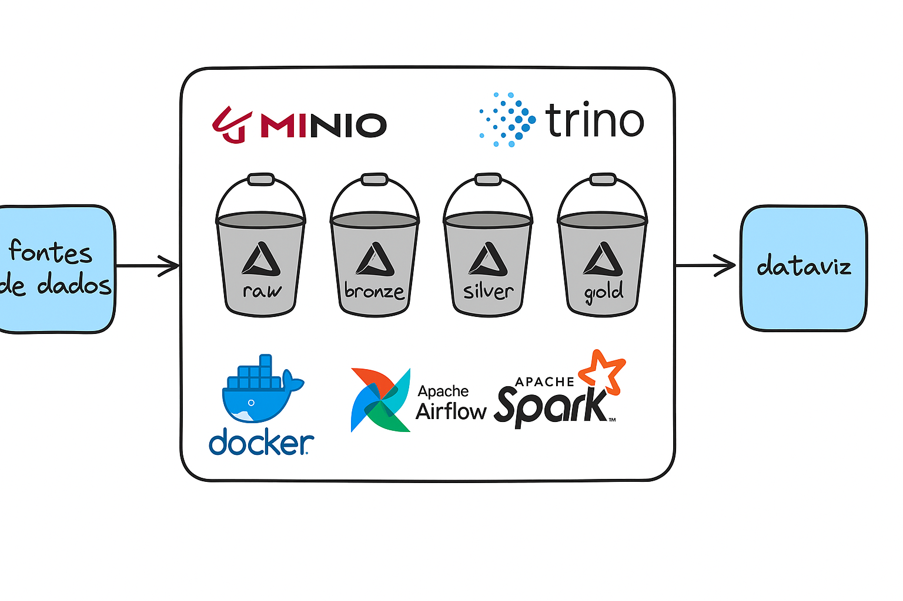

# Lakehouse Athena

Este repositório fornece um exemplo de stack "lakehouse" local usando **Apache Spark** e **MinIO** para armazenamento de objetos. É destinado a experimentos com Spark, tabelas Delta e armazenamento compatível com S3.

## Arquitetura

O diagrama a seguir ilustra como os contêineres se conectam para formar a stack.



## Visão Geral do Repositório

- `docker-compose.yml` – orquestração dos serviços
- `config/` – modelos de configuração do Spark
- `images/` – Dockerfiles utilizados nas imagens
- `dags/` – DAGs de exemplo para o Airflow
- `jobs/` – notebooks e scripts de exemplo
- `trino/` – arquivos de configuração do Trino
- `makefile` – comandos de apoio para operação da stack

## Programas da Stack

- **MinIO** – armazenamento de objetos compatível com S3 utilizado para guardar dados e tabelas Delta (portas 9000 e 9001).
- **Spark/Jupyter** – contêiner com Apache Spark e Jupyter para processamento interativo (porta 8888).
- **Trino** – motor SQL capaz de consultar dados no MinIO e outros catálogos (porta 8090).
- **Airflow** – orquestrador de workflows iniciado via `astro dev start` e disponível em `http://localhost:8080`.

## Requisitos

- [Docker](https://docs.docker.com/get-docker/) com Docker Compose
- [make](https://www.gnu.org/software/make/) para executar o *makefile*
- [Astro CLI](https://docs.astronomer.io/astro/cli/install-cli/) para gerenciar o Airflow local

## Configuração Inicial

1. **Copie o arquivo `.env.example` para `.env`** e ajuste os valores abaixo se necessário:

   ```env
   MINIO_ROOT_USER=minio
   MINIO_ROOT_PASSWORD=miniopass
   MINIO_URI=http://minio:9000
   AWS_ACCESS_KEY_ID=$MINIO_ROOT_USER
   AWS_SECRET_ACCESS_KEY=$MINIO_ROOT_PASSWORD
   ```
   Esses valores são utilizados para gerar `config/spark-defaults.conf` e executar os contêineres.

2. **Inicie a stack**:

   ```bash
   make up
   ```
   O alvo `make up` verifica/cria a rede `lakehouse-athena_524485_airflow`, gera a configuração do Spark e sobe os serviços definidos no `docker-compose.yml`.

3. **Pare a stack**:

   ```bash
   make down
   ```

## Utilização

Acesse o Jupyter Notebook em [http://localhost:8888](http://localhost:8888). A autenticação vem desabilitada por padrão. Há um notebook de exemplo em `jobs/teste.ipynb` demonstrando a escrita de uma pequena tabela Delta no MinIO.
A interface do Airflow fica em [http://localhost:8080](http://localhost:8080) (credenciais padrao "admin"/"admin").
O Trino pode ser acessado em [http://localhost:8090](http://localhost:8090).

MinIO fica disponível em:

- **API**: `http://localhost:9000`
- **Console**: `http://localhost:9001`

Utilize as credenciais do arquivo `.env` para fazer login.

## Configuração do Trino

O diretório `trino/` contém os arquivos que controlam o comportamento do serviço:

- `etc/config.properties` – configurações básicas do servidor, como porta e identificação do coordenador.
- `etc/node.properties` – informações do nó e caminho onde os dados serão armazenados.
- `etc/jvm.config` – opções de memória e parâmetros da JVM utilizados na inicialização.
- `etc/catalog/hive.properties` – catálogo Hive local usado para testes rápidos.
- `etc/catalog/minio.yaml` – catálogo Delta Lake apontando para o MinIO e usando as credenciais definidas em `.env`.

A pasta `data/` é montada em `/var/trino/data` e armazena logs e outros artefatos gerados pelo Trino.

## Customização

- **Configuração do Spark**: edite `config/spark-defaults.conf.template` e execute `make build` ou `make up` para reconstruir.
- **Imagens Docker**: os Dockerfiles em `images/` podem ser adaptados para instalar dependências adicionais.
- **Jobs/Notebooks**: adicione seus notebooks ou scripts Spark em `jobs/`.

## Testes

Execute `pytest` para validar os DAGs e garantir que não há erros de importação.
Certifique-se de que as dependências de `requirements.txt` estejam instaladas antes de rodar os testes.

## Licença

Este projeto é fornecido "no estado em que se encontra" para fins educacionais.
